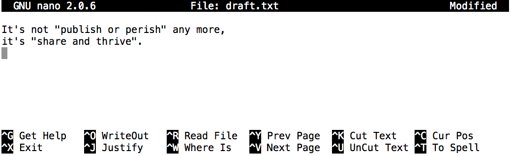

:::::::::::::::::::::::::::::::::::::: questions
- How can I create, copy, and delete files and directories?
- How can I display the contents of the files?
::::::::::::::::::::::::::::::::::::::::::::::::

::::::::::::::::::::::::::::::::::::: objectives
- Create new directories, also known as folders.
- Create files within directories using an editor or by copying and renaming existing files.
- Display the contents of a file using the command line.
- Delete specified files and/or directories.
::::::::::::::::::::::::::::::::::::::::::::::::

We now know how to explore files and directories,
but how do we create them in the first place?

First, let's check where we are:

```bash
$ pwd
```

```output
/Users/nelle/shell-novice/shell/test_directory
```

If you're not in this directory, use the `cd` command to navigate to it as covered in the last lesson, for example:

```bash
$ cd ~/shell-novice/shell/test_directory
```

### Creating a new directory

Now let's use `ls -F` to see what our test directory contains:

```bash
$ ls -F
```

```output
co2_data/   data/       north-pacific-gyre/  pizza.cfg  writing/
creatures/  molecules/  notes.txt            solar.pdf
```

Let's create a new directory called `thesis` using the command `mkdir thesis`
(which has no output):

```bash
$ mkdir thesis
```

As you might (or might not) guess from its name,
`mkdir` means "make directory".
Since `thesis` is a relative path
(i.e., doesn't have a leading slash),
the new directory is created in the current working directory:

```bash
$ ls -F
```

```output
co2_data/   data/       north-pacific-gyre/  pizza.cfg  thesis/
creatures/  molecules/  notes.txt            solar.pdf  writing/
```

However, there's nothing in it yet - this will show no output:

```bash
$ ls -F thesis
```

### Creating a new text file

Now we'll create a new file using a text editor in this new directory.

Let's first change our working directory to `thesis` using `cd`,
and then we'll use the `Nano` editor to create a text file called `draft.txt`, and then save it in that directory.

```bash
$ cd thesis
$ nano draft.txt
```

We add a filename after the `nano` command to tell it that we want to edit (or in this case create) a file.

Now, let's type in a few lines of text, for example:

{alt='Screenshot of the nano text editor with some text typed into it.'}

Once we have a few words, to save this data in a new `draft.txt` file we then use `Control-O` (pressing `Control` and the letter `O` at the same time), and then press `Enter` to confirm the filename.

Once our file is saved, we can use `Control-X` to quit the editor and return to the shell.

::::::::::::::::::::::::::::::::::::: callout
## Which Editor?

When we say, "`nano` is a text editor," we really do mean "text": it can
only work with plain character data, not tables, images, or any other
human-friendly media. We use it in examples because almost anyone can
drive it anywhere without training, but please use something more
powerful for real work.

On Windows, you may wish to use [Notepad++](http://notepad-plus-plus.org/).
A more powerful example is Microsoft's [VSCode](https://code.visualstudio.com/).
It's a fairly standard text editor that can be
installed on Windows, Mac or Linux but also has some handy features like
code highlighting that make it easy to write scripts and code. Similar
editors exist like [Atom](https://atom.io/), a highly customisable text editor which
also runs on these platforms.

Your choice of editor will depend on the size of project you're working on,
and how comfortable you are with the terminal.
::::::::::::::::::::::::::::::::::::::::::::::::

`nano` doesn't leave any output on the screen after it exits, but `ls` now shows that we have created a file called `draft.txt`:

Now we've saved the file, we can use `ls` to see that there is a new file in the directory called `draft.txt`:

```bash
$ ls
```

```output
draft.txt
```

We can use the shell on its own to take a look at its contents using the `cat` command (which we can use to print the contents of files):

```bash
$ cat draft.txt
```

```output
It's not "publish or perish" any more,
it's "share and thrive".
```

::::::::::::::::::::::::::::::::::::: discussion
## Quick Note

You can also use **`nano`** without specifying a filename initially. In this case, you will be prompted to
enter the path and filename when you save your work inside the buffer. This allows you to start typing and
editing without deciding on a filename right away.
::::::::::::::::::::::::::::::::::::::::::::::::

### Deleting files and directories

Now, let's assume we didn't actually need to create this file. We can delete it by running `rm draft.txt`:

```bash
$ rm draft.txt
```

This command removes files (`rm` is short for "remove").
If we run `ls` again, its output is empty once more, which tells us that our file is gone:

```bash
$ ls
```

::::::::::::::::::::::::::::::::::::: caution
## Deleting Is Forever

The Bash shell doesn't have a trash bin that we can recover deleted
files from. Instead,
when we delete files, they are unhooked from the file system so that
their storage space on disk can be recycled. Tools for finding and
recovering deleted files do exist, but there's no guarantee they'll
work in any particular situation, since the computer may recycle the
file's disk space right away.
::::::::::::::::::::::::::::::::::::::::::::::::

But what if we want to delete a directory, perhaps one that already contains a file? Let's re-create that file
and then move up one directory using `cd ..`:

```bash
$ pwd
```

```output
/Users/nelle/shell-novice/test_directory/thesis
```

```bash
$ nano draft.txt
$ ls
```

```output
draft.txt
```

```bash
$ cd ..
$ pwd
```

```output
/Users/nelle/shell-novice/shell/test_directory
```

If we try to remove the entire `thesis` directory using `rm thesis`,
we get an error message:

```bash
$ rm thesis
```

```error
rm: cannot remove `thesis': Is a directory
```

On a Mac, it may look a bit different (`rm: thesis: is a directory`), but means the same thing.

This happens because `rm` only works on files, not directories.
The right command is `rmdir`,
which is short for "remove directory".
It doesn't work yet either, though,
because the directory we're trying to remove isn't empty (again, it may look a bit different on a Mac):

```bash
$ rmdir thesis
```

```error
rmdir: failed to remove `thesis': Directory not empty
```

This little safety feature can save you a lot of grief,
particularly if you are a bad typist.
To really get rid of `thesis` we must first delete the file `draft.txt`:

```bash
$ rm thesis/draft.txt
```

The directory is now empty, so `rmdir` can delete it:

```bash
$ rmdir thesis
```

::::::::::::::::::::::::::::::::::::: callout
## With Great Power Comes Great Responsibility

Removing the files in a directory just so that we can remove the
directory quickly becomes tedious. Instead, we can use `rm` with the
`-r` flag (which stands for "recursive"):

```bash
$ rm -r thesis
```

This removes everything in the directory, then the directory itself. If
the directory contains sub-directories, `rm -r` does the same thing to
them, and so on. It's very handy, but can do a lot of damage if used
without care.
::::::::::::::::::::::::::::::::::::::::::::::::

### Renaming and moving files and directories

Let's create that directory and file one more time.

```bash
$ pwd
```

```output
/Users/user/shell-novice/shell/test_directory
```

```bash
$ mkdir thesis
```

Again, put anything you like in this file (note we're giving the `thesis` path to `nano` as well as the `draft.txt` filename, so we create it in that directory):

```bash
$ nano thesis/draft.txt
$ ls thesis
```

```output
draft.txt
```

`draft.txt` isn't a particularly informative name,
so let's change the file's name using `mv`,
which is short for "move":

```bash
$ mv thesis/draft.txt thesis/quotes.txt
```

The first parameter tells `mv` what we're "moving",
while the second is where it's to go.
In this case,
we're moving `thesis/draft.txt` (the file `draft.txt` in the `thesis` directory) to `thesis/quotes.txt` (the `quotes.txt` again in the `thesis` directory),
which has the same effect as renaming the file.
Sure enough,
`ls` shows us that `thesis` now contains one file called `quotes.txt`:

```bash
$ ls thesis
```

```output
quotes.txt
```

Just for the sake of inconsistency,
`mv` also works on directories --- there is no separate `mvdir` command.

Let's move `quotes.txt` into the current working directory.
We use `mv` once again,
but this time we'll just use the name of a directory as the second parameter
to tell `mv` that we want to keep the filename,
but put the file somewhere new.
(This is why the command is called "move".)
In this case,
the directory name we use is the special directory name `.` that we mentioned earlier.

```bash
$ mv thesis/quotes.txt .
```

The effect is to move the file from the directory it was in to the current working directory.
`ls` now shows us that `thesis` is empty:

```bash
$ ls thesis
```

Further,
`ls` with a filename or directory name as a parameter only lists that file or directory.
We can use this to see that `quotes.txt` is still in our current directory:

```bash
$ ls quotes.txt
```

```output
quotes.txt
```

### Copying files

The `cp` command works very much like `mv`,
except it copies a file instead of moving it.
We can check that it did the right thing using `ls`
with two paths as parameters --- like most Unix commands,
`ls` can be given thousands of paths at once:

```bash
$ cp quotes.txt thesis/quotations.txt
$ ls quotes.txt thesis/quotations.txt
```

```output
quotes.txt   thesis/quotations.txt
```

To prove that we made a copy,
let's delete the `quotes.txt` file in the current directory
and then run that same `ls` again (we can get to this command by pressing the up arrow twice).

```bash
$ rm quotes.txt
$ ls quotes.txt thesis/quotations.txt
```

```error
ls: cannot access quotes.txt: No such file or directory
thesis/quotations.txt
```

This time it tells us that it can't find `quotes.txt` in the current directory,
but it does find the copy in `thesis` that we didn't delete.

## Exercises

::::::::::::::::::::::::::::::::::::: challenge
## Challenge 1: Renaming files

Suppose that you created a `.txt` file in your current directory to contain a list of the
statistical tests you will need to do to analyze your data, and named it: `statstics.txt`

After creating and saving this file you realize you misspelled the filename! You want to
correct the mistake, which of the following commands could you use to do so?

1. `cp statstics.txt statistics.txt`
2. `mv statstics.txt statistics.txt`
3. `mv statstics.txt .`
4. `cp statstics.txt .`

:::::::::::::::::::::::: solution
## Solution

**2** is the best choice. Passing `mv` or `cp` `.` as a destination moves or copies
without renaming, so the spelling mistake won't be fixed.

Both **1** and **2** will leave you with a file called `statistics.txt` at the end, but if you use `cp` it will be a copy, and you'll still have your incorrectly-named original.
:::::::::::::::::::::::::::::::::
::::::::::::::::::::::::::::::::::::::::::::::::

::::::::::::::::::::::::::::::::::::: challenge
## Challenge 2: Moving and Copying

What is the output of the closing `ls` command in the sequence shown below?

```bash
$ pwd
```

```output
/Users/jamie/data
```

```bash
$ ls
```

```output
proteins.dat
```

```bash
$ mkdir recombine
$ mv proteins.dat recombine
$ cp recombine/proteins.dat ../proteins-saved.dat
$ ls
```

1.   `proteins-saved.dat recombine`
2.   `recombine`
3.   `proteins.dat recombine`
4.   `proteins-saved.dat`

:::::::::::::::::::::::: solution
## Solution

The correct answer is **2**.
The commands showed the directory contains a single file named `proteins.dat`,
then created a new directory called `recombine`, moved the original `proteins.dat` file into it,
and finally copied `proteins.dat` into **the directory above the current one** as `proteins-saved.dat`.

So as it's in the directory above the current one (`..`), it won't show up when you do `ls` in the current directory.
:::::::::::::::::::::::::::::::::
::::::::::::::::::::::::::::::::::::::::::::::::

::::::::::::::::::::::::::::::::::::: challenge
## Challenge 3: Organizing Directories and Files

Jamie is working on a project and she sees that her files aren't very well organized:

```bash
$ ls -F
```

```output
analyzed/  fructose.dat    raw/   sucrose.dat
```

The `fructose.dat` and `sucrose.dat` files contain output from her data
analysis. What command(s) covered in this lesson does she need to run so that the commands below will produce the output shown?

```bash
$ ls -F
```

```output
analyzed/   raw/
```

```bash
$ ls analyzed
```

```output
fructose.dat    sucrose.dat
```

:::::::::::::::::::::::: solution
## Solution

`ls` lists the contents of the current directory, whilst `ls analyzed` lists the contents of the `analyzed` directory.

So we need to move the files `fructose.dat` and `sucrose.dat` out of the current directory, and into the `analyzed` directory, which we do with `mv`.

```bash
$ ls -F
$ mv fructose.dat analyzed/
$ mv sucrose.dat analyzed/
$ ls analyzed
```
:::::::::::::::::::::::::::::::::
::::::::::::::::::::::::::::::::::::::::::::::::

::::::::::::::::::::::::::::::::::::: challenge
## Challenge 4: Copy with Multiple Filenames

What does `cp` do when given several filenames and a directory name, as in:

```bash
$ mkdir backup
$ cp thesis/citations.txt thesis/quotations.txt backup
```

:::::::::::::::::::::::: solution
## Solution

It copies the files to the directory with the same name.

```bash
$ ls backup
```

```output
citations.txt    quotations.txt
```
:::::::::::::::::::::::::::::::::

What does `cp` do when given three or more filenames, as in:

```bash
$ ls -F
```

```output
intro.txt    methods.txt    survey.txt
```

```bash
$ cp intro.txt methods.txt survey.txt
```

:::::::::::::::::::::::: solution
## Solution

You should get an error and the command does nothing.
When passing 3 or more arguments, the last one needs to be a directory.

However,

```bash
$ cp intro.txt methods.txt
```

Will not fail even though both of the arguments are existing files - it will copy the contents
of `intro.txt` *over* the contents of `methods.txt`. So be careful!
:::::::::::::::::::::::::::::::::
::::::::::::::::::::::::::::::::::::::::::::::::

::::::::::::::::::::::::::::::::::::: keypoints
- Command line text editors let you edit files in the terminal.
- You can open up files with either command-line or graphical text editors.
- `nano [path]` creates a new text file at the location `[path]`, or edits an existing one.
- `cat [path]` prints the contents of a file.
- `rmdir [path]` deletes an (empty) directory.
- `rm [path]` deletes a file, `rm -r [path]` deletes a directory (and contents!).
- `mv [old_path] [new_path]` moves a file or directory from `[old_path]` to `[new_path]`.
- `mv` can be used to rename files, e.g. `mv a.txt b.txt`.
- Using `.` in `mv` can move a file without renaming it, e.g. `mv a/file.txt b/.`.
- `cp [original_path] [copy_path]` creates a copy of a file at a new location.
::::::::::::::::::::::::::::::::::::::::::::::::
